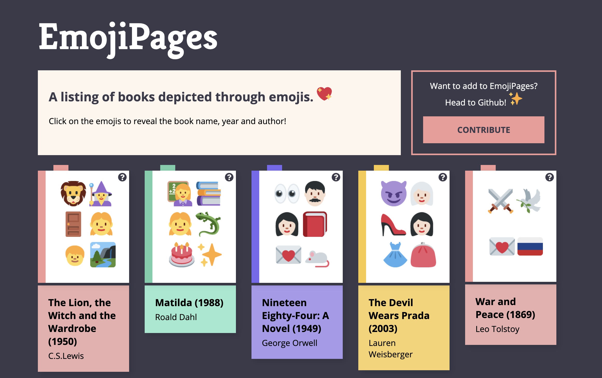
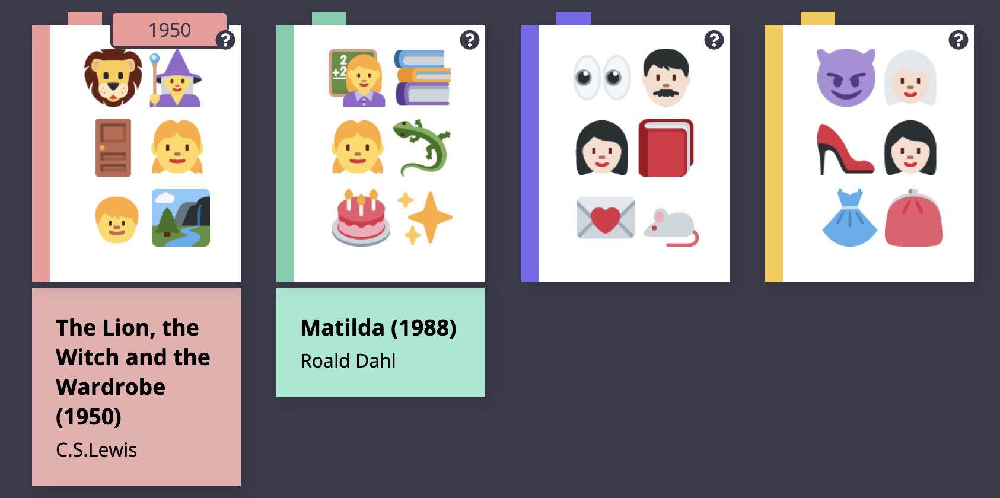
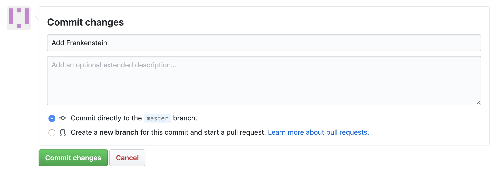
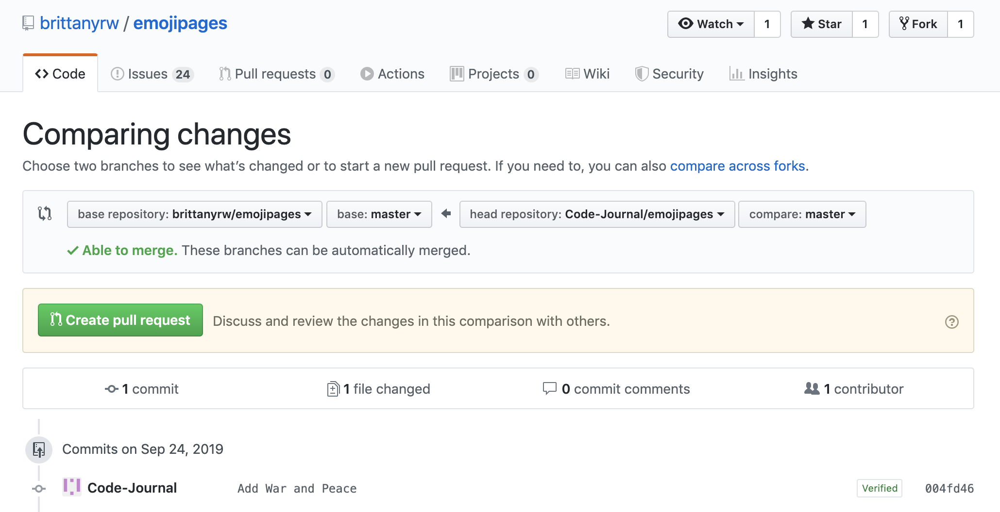

# EmojiPages 📚 
## A listing of books and play depicted through emojis.

[Visit emojipages.com](https://emojipages.com)



## Also contribute to our companion projects:

## [EmojiScreen: A listing of TV shows, movies and musicals depicted as emojis](https://github.com/brittanyrw/emojiscreen/).

## [EmojiBops: A listing of songs depicted via emojis](https://github.com/brittanyrw/emojibops/).

> These projects were built to create a fun, judgement free space for those learning Git and Github to practice making pull requests, branches, adding features, and more. 💛 💙 💜 💚 💖

## Contributing 🎁

Below are instructions for how to contribute to this project. The easiest way to make a contribution is to add an `Emoji Card` to the website. This card should show a number of emojis that match a book or play. 

For other ways to contribute, see the repo Issues [under the label 'enhancement'](https://github.com/brittanyrw/emojipages/issues?q=is%3Aopen+is%3Aissue+label%3Aenhancement). If you want to work on one of the features but aren't sure where to start, write a comment and I will be happy to help you out or get you started. You are also welcome to suggest other features [by adding an Issue](https://github.com/brittanyrw/emojipages/issues).

### Contribution Guidlines

Below are some guidelines to follow when contributing to this project. 

#### We are limiting contributions per person to 4 additions per project. 
* Please limit yourself to adding 4 books/plays and/or completing 4 Issues. This is due to the high level of activity on this project at the moment. We want to make sure many people have a chance to contribute to this project. The limit will be lifted once the activity has died down. 🙂

#### Check Issues and current Pull Requests before contributing to avoid adding duplicates. 
* If your Pull Request is a duplicate, we will let you know so that you can update it if you like. 
 
#### If someone has commented inside of the Issue saying they are working on it, that item is reserved for them. 
* Please choose something else to add if someone else has already said they will add something. We will close Pull Requests and mark them as invalid if you are purposely creating Pull Requests for Issues that someone else has reserved in an attempt to try to race someone in adding something. 

#### Please limit Pull Requests to adding a book/play, completing an Issue or adding a feature. 
* We are not accepting Pull Requests for things such as white space updates or README.md updates for Hacktoberfest. These types of Pull Requests will be marked as invalid. 

#### Please do not approve or make suggestions on other people's Pull Requests.
* We do not need additional maintainers at this time. To avoid confusion and incorrect approvals, only maintainers approve Pull Requests. 

### If you want to work on one of the [Issues to add a book](https://github.com/brittanyrw/emojipages/labels/add%20book)
* Please comment in the Issue so that others know to not add that book. You do not have to wait for confirmation for Issues adding books or plays before creating a Pull Request. Your comment will just help 'bookmark' the Issue for you to prevent duplicate Pull Requests.

### If you want to work on one of the Issues that are labeled with `enhancement` 
* Please comment in the Issue and wait for confirmation before you start working on it.

Read below for a detailed overview and walkthrough on how to add an `Emoji Card` to this project. Please read all of the instructions before contributing! First time pull-requests are encouraged and you can make multiple pull requests if you desire. If you run into trouble, feel free [to create an Issue](https://github.com/brittanyrw/emojipages/issues)!

## Table of Contents

- [Choosing a Book or Play to Add](#choosing-a-book-or-play-to-add)
- [Emoji Card Overview](#card-overview)
- [Contribution Walkthroughs](#walkthrough)
  - [Contribute using Github Website (no downloads required)](#github-ui)
  - [Contribute using your local development environment (downloads required)](#local-development)  
- [Git & Github Resources](#other-resources-and-options)
- [Credits](#credits)

## Choosing a Book or Play to Add

Here are some links to lists of books and plays in case you're having trouble thinking of something to add! 

#### I have also [added Issues for individual books and plays](https://github.com/brittanyrw/emojipages/labels/add%20book) that I think would be fun to add to EmojiPages. Feel free to add any of the books listed in Issues. Make sure to comment inside of the Issue if you plan on taking it and add the Issue number in your Pull Request.

### Issues by Genre
> These are loose, very general genres just to help categorize issues. You can use more specific genres when you add cards.
* View [Issues for Adventure Books](https://github.com/brittanyrw/emojipages/labels/adventure)
* View [Issues for Children's Books](https://github.com/brittanyrw/emojipages/labels/Fairytale%20%26%20Children%27s)
* View [Issues for Classic Books](https://github.com/brittanyrw/emojipages/labels/classic)
* View [Issues for Crime Books](https://github.com/brittanyrw/emojipages/labels/crime)
* View [Issues for Dystopian Books](https://github.com/brittanyrw/emojipages/labels/dystopian)
* View [Issues for Fantasy Books](https://github.com/brittanyrw/emojipages/labels/fantasy)
* View [Issues for Historical Books](https://github.com/brittanyrw/emojipages/labels/historical)
* View [Issues for Historical Books](https://github.com/brittanyrw/emojipages/labels/horror)
* View [Issues for Mystery Books](https://github.com/brittanyrw/emojipages/labels/mystery)
* View [Issues for Plays/Theater](https://github.com/brittanyrw/emojipages/labels/play)
* View [Issues for Romance Books](https://github.com/brittanyrw/emojipages/labels/romance)
* View [Issues for Satire Books](https://github.com/brittanyrw/emojipages/labels/satire)
* View [Issues for Science Fiction Books](https://github.com/brittanyrw/emojipages/labels/Science%20Fiction)
* View [Issues for Young Adult Books](https://github.com/brittanyrw/emojipages/labels/Young%20Adult)


### Book/Play Lists
* [The Greatest Books List](https://thegreatestbooks.org/)
* [ALL-TIME 100 Novels - Time Magazine](http://entertainment.time.com/2005/10/16/all-time-100-novels/?iid=ent-category-mostpop1)
* [100 (Fiction) Books to Read in a Lifetime](https://www.abebooks.com/books/100-books-to-read-in-lifetime/index.shtml)
* [102 of the Greatest Books by Female Authors](https://www.listchallenges.com/102greatestbooksfemaleauthors)
* [60 must-read books by women](https://www.penguin.co.uk/articles/2019/mar/best-books-by-female-authors/)
* [Goodreads Best Book Lists](https://www.goodreads.com/list/tag/best)
* [Top 100 Stage Plays of All Time](https://www.goodreads.com/list/show/13581.Goodreads_Top_100_Stage_Plays_of_All_Time)
* [The Best Writers of All Time](https://www.ranker.com/list/best-writers-of-all-time/ranker-books)
* [New York Times Bestsellers](https://www.nytimes.com/books/best-sellers/)


## Card Overview

On the website, each `Emoji Card` displays 1) images of the emojis, 2) a hint icon that will show the year the book was published (when the user hovers over the question mark) and 3) the name of the book (which appears when the user clicks on a card).



In the `data.js` file, each `Emoji Card` consists of the following object:

```
{
    title: "The Devil Wears Prada",
    author: "Lauren Weisberger",
    emojiImgs: "😈👩🏻‍🦳👠👩🏻👗👛",
    genres: ["drama", "comedy","romance"],
    year: 2003
}
```

To add a new card to the website, add a new object in the `data.js` file. Make sure to separate your new object from existing objects with a comma. Below is an overview of each key in the `Emoji Card` object. Every key is required.

### Title 👍

Each card must have a title. This should be the full title.

```
{
  title: "The Devil Wears Prada",
}
```

### Author 📚

Add the author as a string. If there are multiple authors, include them all in one string such as `author: "Author One, Author Two"`.

```
{
  author: "Lauren Weisberger",
}
```

### Emojis 😍

The emojis should be added to `emojiImgs` as a string. Your emojis should be surrounded by double quotation marks.

## **Important Note: Add at least four emojis and a maxioum of six emojis for each card**

```
{
  emojiImgs: "😈👩🏻‍🦳👠👩🏻👗👛",
}
```

Using JavaScript, the emojis are converted into [Twemoji (Twitter's emoji version)](https://github.com/twitter/twemoji) so that all emojis will be uniform across platforms. And because they are pretty cute. 💖

Here are a few resources to find emojis to copy:

- [Twitter Emojis](https://www.piliapp.com/twitter-symbols/) - Shows you what each Twitter emoji looks like. 
- [Get Emoji](https://getemoji.com/) and [EmojiCopy](https://www.emojicopy.com/) are tools to copy regular emojis easily from one page. Note: The initial homepage does not display all skin color versions of each emoji so you will need to search in Emojipedia for those.
- [Emojipedia](https://emojipedia.org/) - A directory of all emojis.

Note when you copy these emojis and paste them into your text editor or Github, they will no longer look like the Twitter emojis. But don't worry, Javascript will convert them to the Twitter emojis on the EmojiPages website.

### Genres 🔍

The genres should be added as an array (the square [] brackets indicates an array or list). Separate each genre with a comma and each genre should be wrapped in quotes. There is no limit to the number of genres but try not to add too many.

```
{
  genres: ["drama", "comedy","romance"],
}
```

Select your genres [from this list of genres](https://github.com/brittanyrw/emojipages/blob/master/genres.md). If you want to use a genre that is not on this list, in your pull request please add the genre to the `genres.md` file. 

If you need ideas for what genres to select, you can check the Wikipedia page for the book as well as the [Goodreads](https://www.goodreads.com/) page for the book to help you out. 

### Year 📆

Specify the year the book was published. This should be a single number with no quotations around the year.

```
{
  year: 1994
}
```

## Walkthrough

Follow these instructions to add a card. You can add a card using the Github website user interface or on your local machine. If you do not already have one, create a Github account before proceeding.

> If you are already comfortable using Github and Git, feel free to skip the instructions below and make a pull request using whatever method you prefer!

## Github UI

### This method will use the Github website to contribute to this project. You will not need to download any programs to your computer using these instructions.

1. Check the [Issues to see if the book](https://github.com/brittanyrw/emojipages/issues?q=is%3Aopen+is%3Aissue+label%3A%22Add+Book%22) you would like to add is listed. You can filter the Issues by genre if desired.
- If it is not listed as an issue, continue to the next step.
- If it is listed as an Issue, take note of the Issue number (the number next to the title of the Issue) so that you can add it to your pull request and write a comment in the Issue stating that you will be adding that particular book. If there is already a comment in the Issue from someone saying that they will add that book, choose something else to add. 
2. Fork this repository. This will create a copy of the repository and create a new repository on your account. Note: the `Fork` button is located in the top right area of the repo.
3. Once the repo is forked, you will be taken to the forked repo. Note: In the top left, the name of the repo should now include your username.
4. Navigate to the `data.js` file in your forked repo by clicking on the file name.
5. Edit the `data.js` file by clicking on the pencil icon and add a new object for your book or play in alphabetical order.  **Note: If the title starts with 'The' then use the next word for alphabetical order.** Make sure there is a comma between your object and the object above and below. Refer to the card overview above for requirements for the different object keys.

Use the following object as a template:

```
{
    title: "The Devil Wears Prada",
    author: "Lauren Weisberger",
    emojiImgs: "😈👩🏻‍🦳👠👩🏻👗👛",
    genres: ["drama", "comedy","romance"],
    year: 2003
}
```

6. Once you have completed updating the object for your book, scroll to the bottom of the page and add a commit message. The commit message should be formatted like: `Added 1984` or `Added all of the Harry Potter books`. Click the `Commit Changes` button to save your changes.



7. Navigate to the `Pull Request` tab. Click on New `Pull Request`.



8. Review your changes and then click `Create Pull Request`. Add any additional comments, go through the checklist within the Pull Request and add an Issue number if applicable, then click on `Create Pull Request`.
9. Wait for feedback/review of your Pull Request. Your code will be reviewed and if any changes need to be made, we will let you know. Once your pull request is accepted, you will be able to see your card at [https://emojipages.com](https://emojipages.com) and you will officially have contributed to the project! 🎉

## Local Development

### This method will use your local machine to contribute to the project. This will require you to download multiple programs onto your computer. This is the method most programmers use when working on projects. 

### Required Downloads & Tools

- Terminal (Mac OS) or Command Prompt. These are installed by default on your computer. Search for the program to open it. **For Windows, [Git Bash](https://gitforwindows.org/) is recommended.**
- [Git](https://git-scm.com/downloads) - This is a version control tool. For Windows, this download will include Git Bash.
- A text editor such as [Sublime Text](https://www.sublimetext.com/), [Atom](https://atom.io/), [Visual Studio Code](https://code.visualstudio.com/download), etc.

### Local Development Instructions

1. Check the [Issues to see if the book](https://github.com/brittanyrw/emojipages/issues?q=is%3Aopen+is%3Aissue+label%3A%22Add+Book%22) you would like to add is listed. You can filter the Issues by genre if desired.
- If it is not listed as an Issue, continue to the next step.
- If it is listed as an Issue, take note of the issue number (the number next to the title of the Issue) so that you can add it to your pull request and write a comment in the Issue stating that you will be adding that particular book. If there is already a comment in the Issue from someone saying that they will add that book, choose something else to add. 
2. Fork this repository. This will create a copy of the repository and create a new repository on your account.
3. Once the repo is forked, you will be taken to the forked repo. Note: In the top left, the name of the repo should now include your username.
4. Download the project to your computer. Click on the `Clone or Download` button. Copy the HTTPS github repo link.
5. In your terminal, navigate to where you would like to save the project (such as `cd Desktop`). Run the following command in the terminal, replacing the following link with your copied link: `git clone https://github.com/your-username-will-be-here/emojipages.git`;
6. After the command has been run, in the terminal, navigate into the EmojiPages project folder: `cd emojipages`.
7. Open the `emojipages` project in your text editor of choice. Edit the `data.js` file and add a new object for your book or play in alphabetical order. **Note: If the title starts with 'The' then use the next word for alphabetical order.**. Make sure there is a comma between your object and the objects above and below. Refer to the card overview above for requirements for the different object keys.  Make sure to save your file after you have made changes. 

Use the following object as a template:

```
{
  title: "Matilda",
  author: "Roald Dahl",
  emojiImgs: "👩‍🏫📚👧🦎🎂✨",
  genres: ["children","fantasy"],
  year: 1988
}
```

8. If you would like to see what your addition will look like, open the `index.html` file that is in the `emojipages` folder in a web browser. The `EmojiCards` are added in a random order so it may take you a few seconds to find what you added. If you do not see any cards in the browser, this could mean that you have a typo in your `data.js` file. If that is the case, double check what you have added for missing commas and quotation marks.
9. Once you are done, go to the terminal and type `git status`. You should see `data.js` as modified. If you don't see this, go back and make sure to save your `data.js` file.
10. Run `git add -A` to add your changes.
11. Add a commit message. Run the following command and replace with your movie or show name: `git commit -m "Added 1984 by George Orwell"`.
12. If you have never used git on your computer before, you will see a message asking for you to set your email and username. If you do not see that message, continue to the next step. Run the following commands, replacing "you@example.com" with your Github email and "Your name" with your github username:

`git config --global user.email "you@example.com"`

`git config --global user.name "Your Name"`

Then re-run the commit command. Remember to replace with your book or play: `git commit -m "Added 1984 by George Orwell"`

13. Run `git push`. If you have not done this before, git push will not run until you login to your Github account. Type in your Github username and password. **NOTE: When you type your password, it will not show in the terminal. Press enter after you type your password to continue**.

14. Go to the Github website and navigate to the `Pull Request` tab. Click on New `Pull Request`.


15. Review your changes and then click `Create Pull Request`. Add any additional comments, go through the checklist within the Pull Request and add an Issue number if applicable, then click on `Create Pull Request`.
16. Wait for feedback/review of your Pull Request. Your code will be reviewed and if any changes need to be made, we will let you know. Once your pull request is accepted, you will be able to see your card at [https://emojipages.com](https://emojipages.com) and you will officially have contributed to the project! 🎉

## Other Resources and Options
* [Git Handbook](https://guides.github.com/introduction/git-handbook/)
* [Additional Git/Github Practice](https://try.github.io/)
* [Visualizing Git Commands Tool](https://git-school.github.io/visualizing-git/)
* Try creating a [new branch](https://github.com/Kunena/Kunena-Forum/wiki/Create-a-new-branch-with-git-and-manage-branches) for your pull request.
* [Syncing your Fork](https://help.github.com/en/articles/syncing-a-fork)

## Credits

💖Check out a list of all [of the EmojiPages contributors](https://github.com/brittanyrw/emojipages/graphs/contributors).

Emoji graphics are by Twitter and are licensed under CC-BY 4.0. Review the [Attribution Requirements](https://github.com/twitter/twemoji#attribution-requirements) for more information.

> Please note that this project is released with a Contributor Code of Conduct. By participating in this project you agree to abide by its terms.
